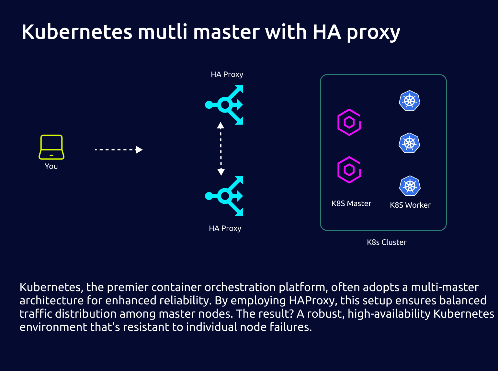

# kube-ansible

# Tested on Ubuntu 24.04 and kubernetes 1.31.2 ✅

# Kubernetes Deployment with HAProxy Load Balancer using Ansible

This Ansible playbook is designed to automate the deployment of Kubernetes in a production environment, using HAProxy as the front-facing load balancer to distribute traffic among Kubernetes nodes for high availability and scalability.



## Prerequisites

Before running this playbook, ensure you have the following prerequisites met:
- Ansible installed on your control machine.
- SSH access configured to all target nodes.
- Target nodes have internet access for downloading necessary packages.
- Python installed on all nodes for Ansible modules to execute properly.

## Configuration

The playbook relies on inventory and variable files for configuration to match your specific environment requirements.

### Inventory File

Update the `inventory/k8s-servers.ini` file to include the IP addresses or hostnames of your Kubernetes nodes under the appropriate groups. For example:

## Variable Files
Customize variables in the `inventory/group_vars/all.yml` file (or any other variable file you're using) to fit your deployment settings, such as Kubernetes version, network settings, and HAProxy configuration.

#### Running the Playbook

Change your `inventory` file to `inventory/k8s-servers.ini` and put your hosts in it

For Install kubernetes you need some preinstall task, for preinstall follow these steps

```bash
ansible-playbook -i inventory/k8s-servers.ini kubernetes.yml  --become --become-method=sudo -t preinstall
```

After that you should install prerequired packages for kubernetes:

```bash
ansible-playbook -i inventory/k8s-servers.ini kubernetes.yml  --become --become-method=sudo -t k8s
```

For initialize kubernetes, follow these steps: (It's for new cluster)

```bash
ansible-playbook -i inventory/k8s-servers.ini kubernetes.yml  --become --become-method=sudo -t init_k8s
```

For join master(s) node to cluster, follow these steps:

```bash
ansible-playbook -i inventory/k8s-servers.ini kubernetes.yml  --become --become-method=sudo -t join_master
```

For join worker(s) node to cluster, follow these steps:

```bash
ansible-playbook -i inventory/k8s-servers.ini kubernetes.yml  --become --become-method=sudo -t join_worker
```

#### If you like to use haproxy for loadbalancing in your kubernetes you can use these bellow step.

```bash
ansible-playbook -i inventory/k8s-servers.ini kubernetes.yml --become --become-method=sudo -t lb
```

and for finilize use (If you use lb tag you MUST run the postinstall task)

```bash
ansible-playbook -i inventory/k8s-servers.ini kubernetes.yml --become --become-method=sudo -t postinstall
```


And also you can limit your task to specific host:

```bash
ansible-playbook -i inventory/k8s-servers.ini kubernetes.yml  --become --become-method=sudo -t join_worker -l k8s-test-worker1
```

Finaly you should run postinstall task:

```bash
ansible-playbook -i inventory/k8s-servers.ini kubernetes.yml  --become --become-method=sudo -t postinstall
```
